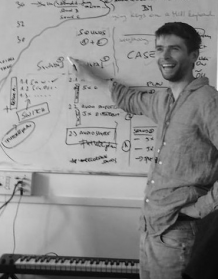

## sonic art
01/2019 - ongoing @ ARU | A 15 credit module at ARU, Cambridge. Students are encourage to take ownership in the decisions made for the syllabus. Weekly discussion support their projects and future plans. [https://khofstadter.info/sonic-art-2019/](https://khofstadter.info/sonic-art-2019/)

 

## music for the moving image
09/2016 - ongoing @ ARU | A 15 credit module that allows students to create original music and sound design for poetry, short films and games using acoustic and computer-based methods of composition as well as provides networking and career opportunities.  Last semester: [https://m4mi.khofstadter.info/](https://m4mi.khofstadter.info/)

 

## sensor technology
09/2018; 09/2017; 09/2014; 09/2011 @ ARU | 15 credit modules outlining creative means of interactions of the Arduino microcontroller with various sensors to manipulate sound and visuals. Last semester: [https://stech.khofstadter.info/](https://stech.khofstadter.info/)

 

## laptop performance
09/2014 – 06/2015 @ ARU | In this 15 credit module students develop their knowledge of digital audio and traditional music theory by creating and performing their own musical works using the laptop computer as the main musical instrument.

 

## audio programming
09/2014 – 06/2015 @ University of Bedfordshire| Teaching SuperCollider language.
Besides teaching I have been a dissertation advisor on several occasions, research-lecture organiser as well as have helped shaping the new ‘Electronic Music’ pathway in the ARU’s music department.

 

