<head>

</head>

### Conference on Accessibility in Film, TV and Interactive Media
University of York, 14/15 Oct 2017 (album on [Flickr](https://flickr.com/photos/tedor/albums/72157665635430759))

 

### EAD Screening in Tate Britain
London, Sep 2017 (album on [Flickr](https://flickr.com/photos/tedor/albums/72157666145868259))

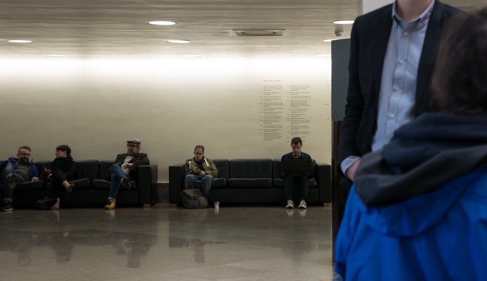

 

### Dialogue Beyond Sight
OXO Gallery, London, Jul 2016 (album on [Flickr](https://flickr.com/photos/tedor/albums/72157671216242465))

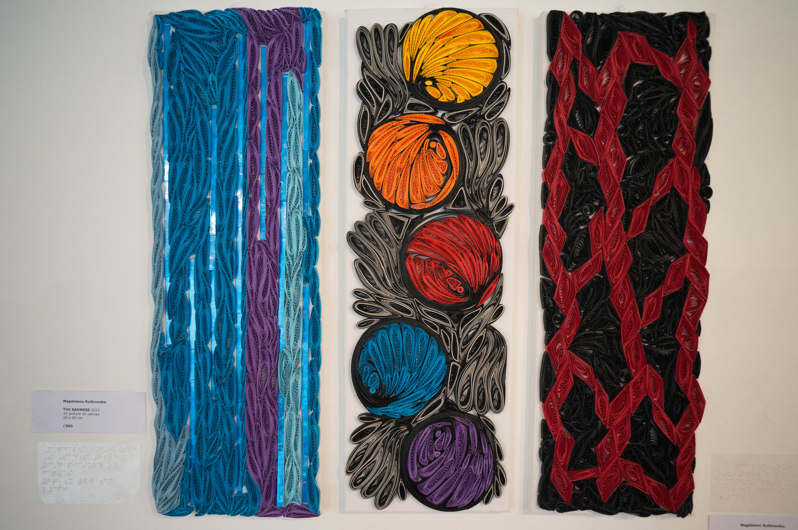

 

### Recitativo @ 395
London, Mar 2016 (album on [Flickr](https://flickr.com/photos/tedor/albums/72157666022841901))

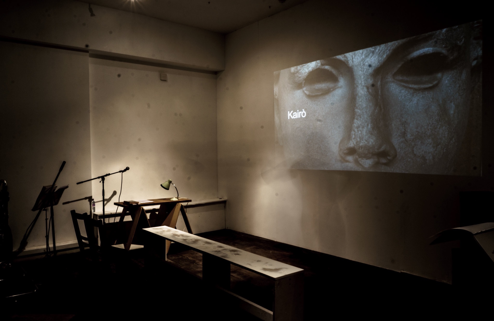

 

### Cambridge Sustainable Residency
Cambridge, Apr 2014 (album on [Flickr](https://flickr.com/photos/tedor/albums/72157661430458739))

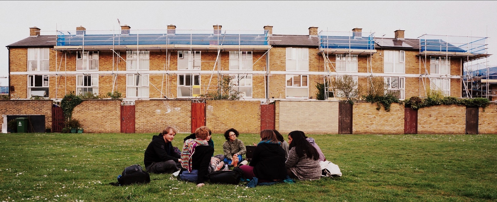

 

### Acoustic Measurement, CODE
Kings College Chapel, Cambridge, Jul 2015 (album on [Flickr](https://flickr.com/photos/tedor/albums/72157657135520589))

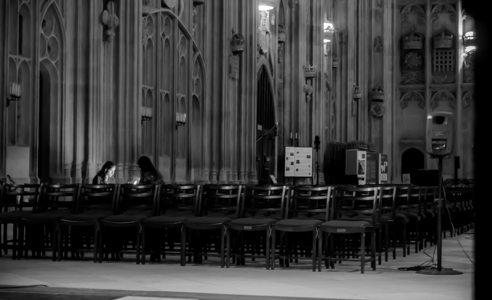

 

### Pictures of You, Menagerie
Junction 2, Cambridge, Jul 2015 (album on [Flickr](https://flickr.com/photos/tedor/albums/72157656450130622/with/19466753473/))

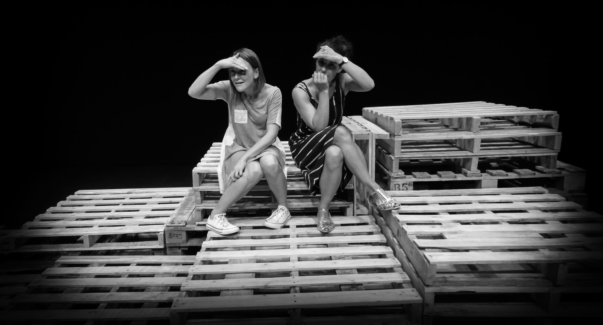

 

### Alpha CRC Cricket
Cambridge, Jul 2015 (album on [Flickr](https://flickr.com/photos/tedor/albums/72157655968775331))

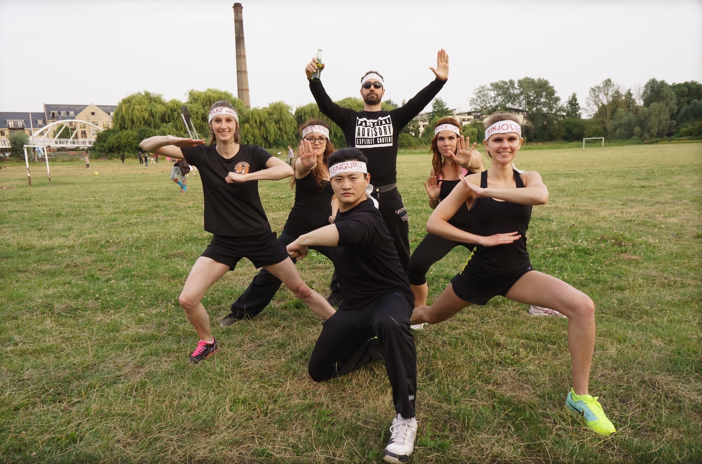

 

### Innovation In Music Conference 2015
ARU, Cambridge, Jul 2015 (album on [Flickr](https://flickr.com/photos/tedor/albums/72157654077765190))

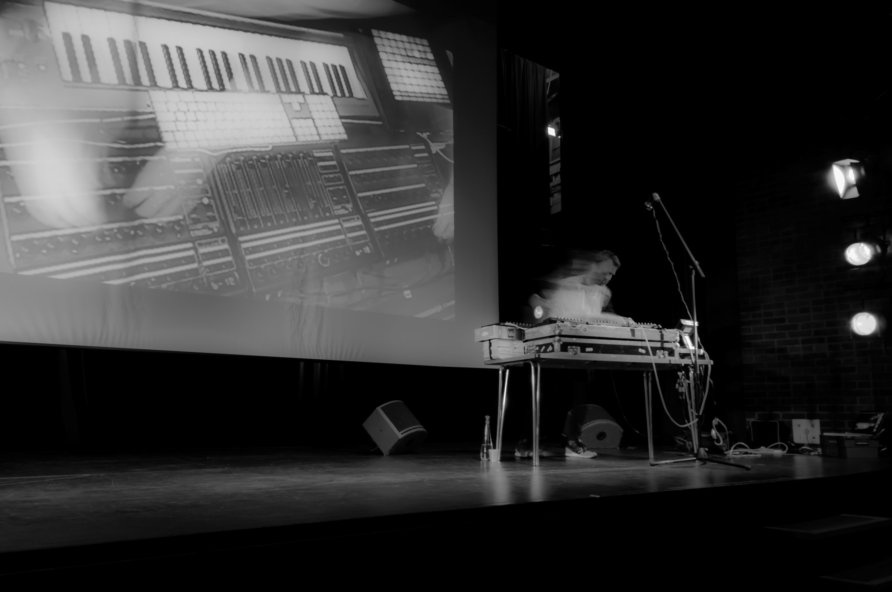

 

### SHINDIG
St Paul's Church, Cambridge, May 2015 (album on [Flickr](https://flickr.com/photos/tedor/albums/72157652909188449))

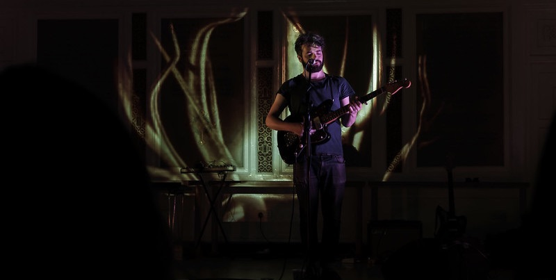

 

### Privat View @ Unit 7
Grafton, Cambridge, May 2015 (album on [Flickr](https://flickr.com/photos/tedor/albums/72157650789291813))

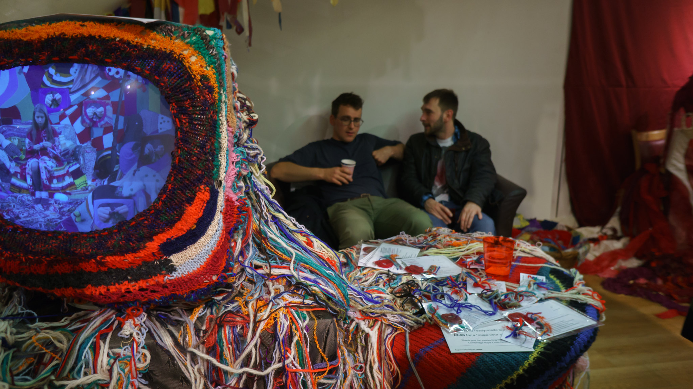

 

### Funky Flamingo Club Night
St Philip's Church, Cambridge, Feb 2015 (album on [Flickr](https://flickr.com/photos/tedor/albums/72157648819387114))

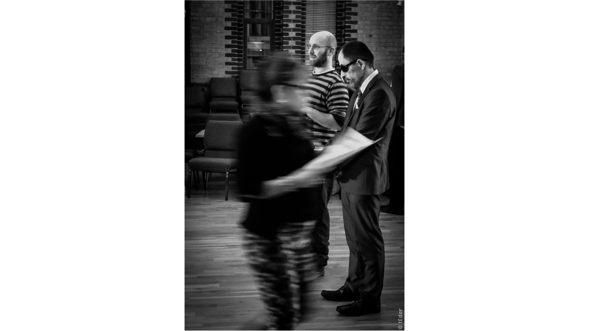

 

### Crafty Cambridge 2014-12-22
Cambridge, Dec 2014 (album on [Flickr](https://flickr.com/photos/tedor/albums/72157649906820595))

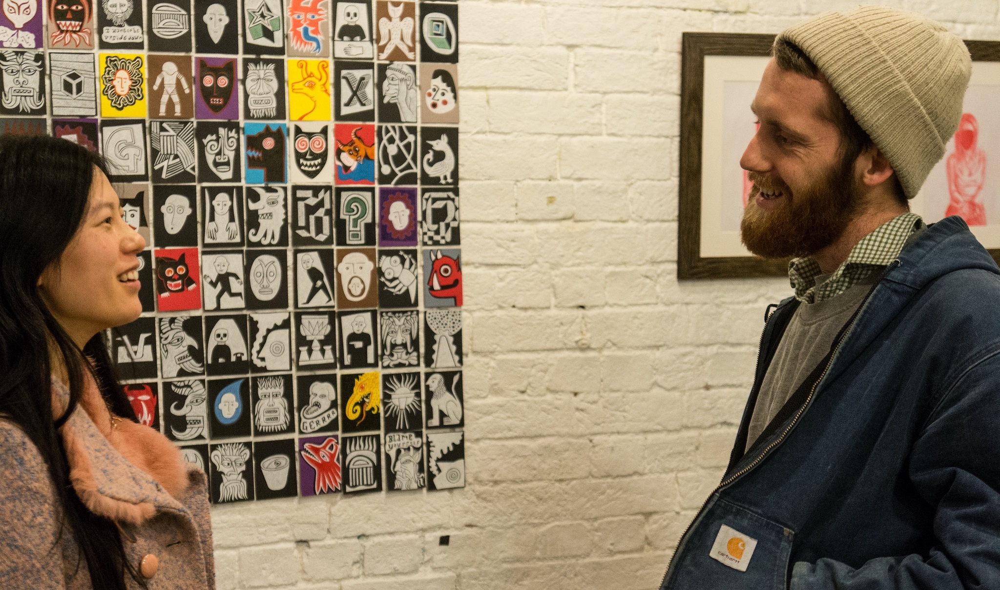

 

### Mayfield Organics
Littleport, 2016 (album on [Flickr](https://www.flickr.com/photos/tedor/albums/72157627326254671))

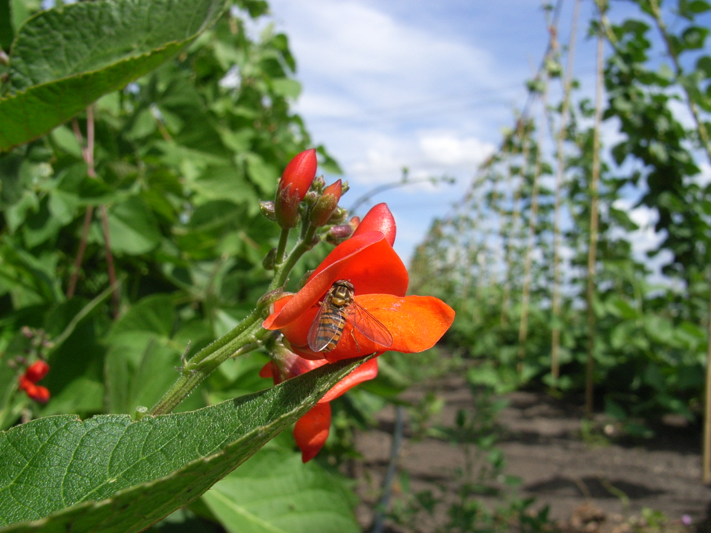

 

