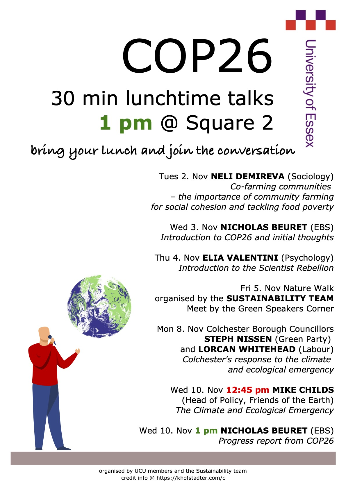

## cop26 poster
- date: 2021 10 28
- author: khofstadter
- credit 1: graphic of person standing with mic <a href="https://www.freepik.com/search?format=search&last_filter=type&last_value=vector&query=public%20speaking&type=vector">designed by pch.vector / Freepik</a>
- credit 2: earth designed by COP26, given as an asset to use by the University of Essex

