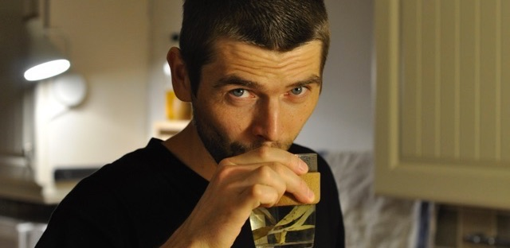

Hello! I am a creative technologist working as a researcher, lecturer, freelancer and artist also known as tEdör. I am a Hungarian, living in England. This website can inform you about my work.

 

Organise projects 
  
  <button class="tablinks" onclick="openCity(event, 'categories')">thematically</button>
  or 
  <button class="tablinks" onclick="openCity(event, 'time')" id="defaultOpen" >chronologically</button> 
  :
  
  <!--
  or 
  <button class="tablinks" onclick="openCity(event, 'tags')">by tags</button>
  -->
  

  <h3>ongoing</h3>
  
  <h3>past</h3>
  

  

 
My cv is [here](https://khofstadter.com/assets/doc/KHofstader-CV.pdf).
  
You can contact me on kris[at]khofstadter[dot]com
  
  _photo by Balázs Kiss_

